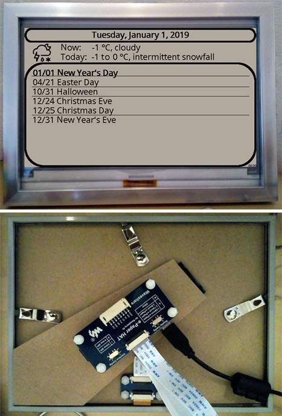

# Raspberry Pi Calendar Frame

Show weather and calendar in a E-Ink frame via Raspberry Pi.



## Prerequisites
- Raspberry Pi Zero WH (pre-soldered headers): https://www.raspberrypi.org/products/raspberry-pi-zero/
- 7.5inch E-Ink display 640x384 from Waveshare: https://www.waveshare.com/wiki/7.5inch_e-Paper_HAT
- Raspberry Pi OS Lite: https://www.raspberrypi.org/downloads/raspberry-pi-os/

## Installation
```
sudo apt update
sudo apt install --yes python3-spidev python3-rpi.gpio python3-pil fonts-wqy-microhei
sudo raspi-config nonint do_spi 0 # Enable SPI
git clone https://github.com/alexgit2k/raspi-calendar.git
cd raspi-calendar
./install.sh
```
## Configuration
See config.py

## Edit entries
http://raspberrypi/

## Powersave
Disable LED, WLAN and Bluetooth and reduce CPU to save power.
```
echo powersave > /sys/devices/system/cpu/cpu0/cpufreq/scaling_governor
cat <<EOT >> /boot/config.txt
# Disable LED (https://github.com/raspberrypi/firmware/blob/master/boot/overlays/README)
# (https://www.jeffgeerling.com/blogs/jeff-geerling/controlling-pwr-act-leds-raspberry-pi)
dtparam=act_led_trigger=none
dtparam=act_led_activelow=on

# Disable WLAN & Bluetooth (https://github.com/raspberrypi/firmware/blob/master/boot/overlays/README)
dtoverlay=pi3-disable-wifi
dtoverlay=pi3-disable-bt
EOT
```

## License and Copyright
This software is Copyright (c) 2019 by alexgit2k.

This is free software, licensed under MIT License.
